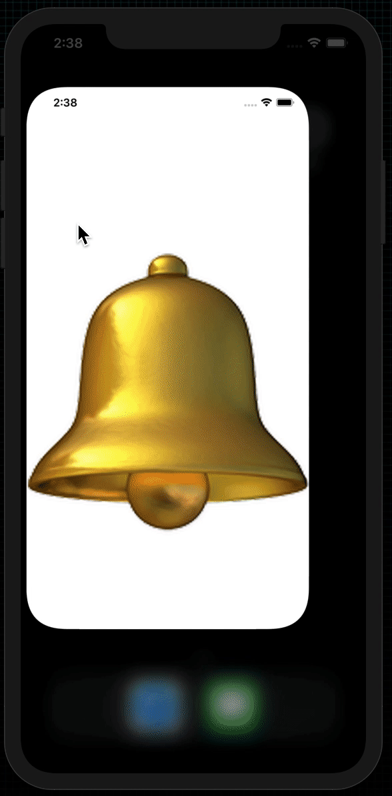

# Local Notifications

  

 
Send reminders to your user's lock screen to show them information when the application isn't running.

## Examples within this code
- UserNotifications

## Demonstration
Small demonstration as to what the application does on device.
 
<!-- 

 -->
